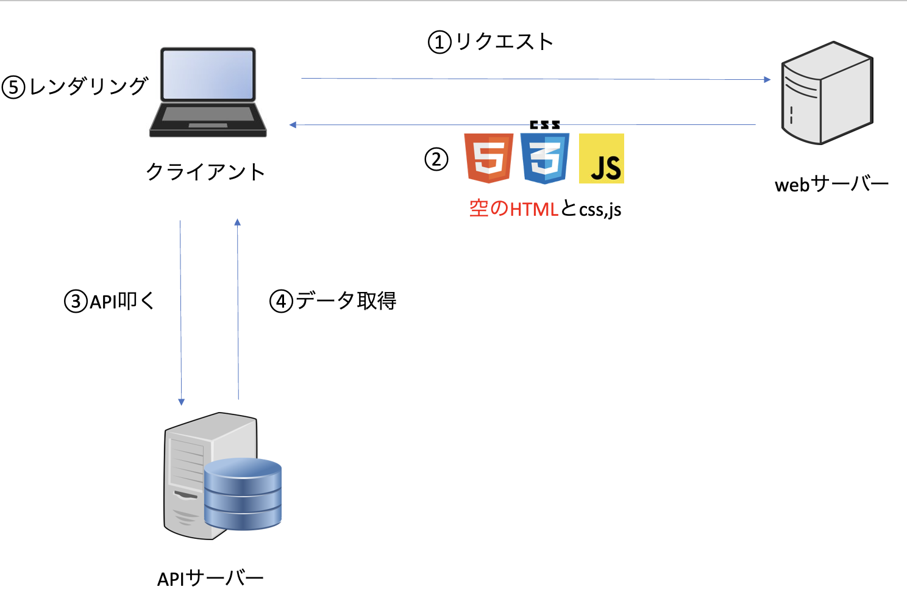

# CSR(クライアントサイドレンダリング)

## はじめに

ここは CSR(クライアントサイドレンダリング)のどのようなレンダリングの仕組みなのか、利点欠点は？などを述べたものとなる。尚、間違っている部分があるかもしれないのでそこはご了承願いたい。

## CSR とは

クライアント(ブラウザ)側で**Javascript がレンダリング**をする手法

## レンダリングまでの流れ



1. web サーバーにリクエストを送る
1. 空の HTML と CSS と Javascript が返される
1. 外部データが必要であれば API を叩く
1. その API のデータを取得する
1. レンダリングをする

```html
<!DOCTYPE html>
<html lang="en">
  <head>
    <meta charset="UTF-8" />
    <meta name="viewport" content="width=device-width, initial-scale=1.0" />
    <title>CSR Example</title>
  </head>
  <body>
    <div id="root"></div>

    <script src="app.js"></script>
  </body>
</html>
```

リクエストをして変換された時の HTML ファイルの一例である。このコードは ChatGPT がほぼ書いたコードであるが少し自分で変更している部分もある。`id="root"`にある部分にどんどん要素を付け足してレンダリングしていくイメージ。

```js
function App() {
  return (
    <div>
      <h1>Hello world</h1>
    </div>
  );
}

ReactDOM.render(<App />, document.getElementById("root"));
```

上記は返ってくる Javascript のファイルである。HTML ファイルの`script`タグの`app.js`に該当する部分である。`id`が`root`の要素を取得しそこにレンダリングしていくプログラム。こちらも GPT に書かせて少し修正を加えた。

## 利点と欠点

### 利点

- ページを遷移するたびにサーバにアクセスしなくて良い
- 初回レンダリング以降データの変更等が高速

### 欠点

- 初回ロードが遅い
- SEO に弱い

## どのようなプロジェクトに向いているか

- SEO を気にしないアプリ
- リアルタイムに操作するアプリ
- 例は todo など

## 参考資料

- [文献 1](https://zenn.dev/rh820/articles/6234843d726ed3)
- [文献 2](https://qiita.com/marl0401/items/d5f0dd91e06c8b52a49d)
- [動画](https://youtu.be/QckiJezDS_E?si=nssWUkcBWQfB6hay)
