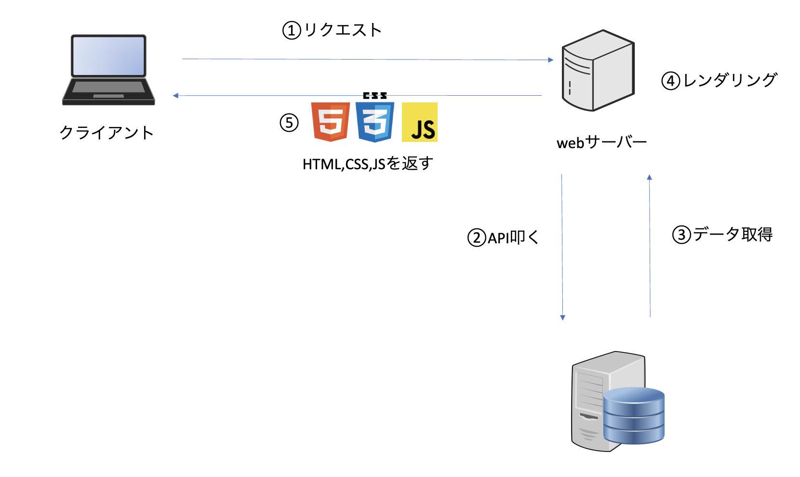

# SSR(サーバーサイドレンダリング)

## はじめに

ここは SSR(サーバーサイドレンダリング)のどのようなレンダリングの仕組みなのか、利点欠点は？などを述べたものとなる。尚、間違っている部分があるかもしれないのでそこはご了承願いたい。

## SSR とは

サーバーサイドでレンダリングをする手法

## レンダリングまでの流れ

1. web サーバーにリクエストを送る
1. 外部データが必要であれば API を叩く
1. その API データを取得する
1. レンダリングする
1. レンダリングした HTML と CSS を返す

## 利点と欠点

### 利点

- 初回レンダリングが早い
- SEO に強い

### 欠点

- 初回レンダリング以降の変更が遅い

## どのようなプロジェクトに向いているか

- SEO に強いサービス

## 参考資料

- [文献 1](https://zenn.dev/rh820/articles/6234843d726ed3)
- [文献 2](https://qiita.com/marl0401/items/d5f0dd91e06c8b52a49d)
- [動画](https://youtu.be/QckiJezDS_E?si=nssWUkcBWQfB6hay)
